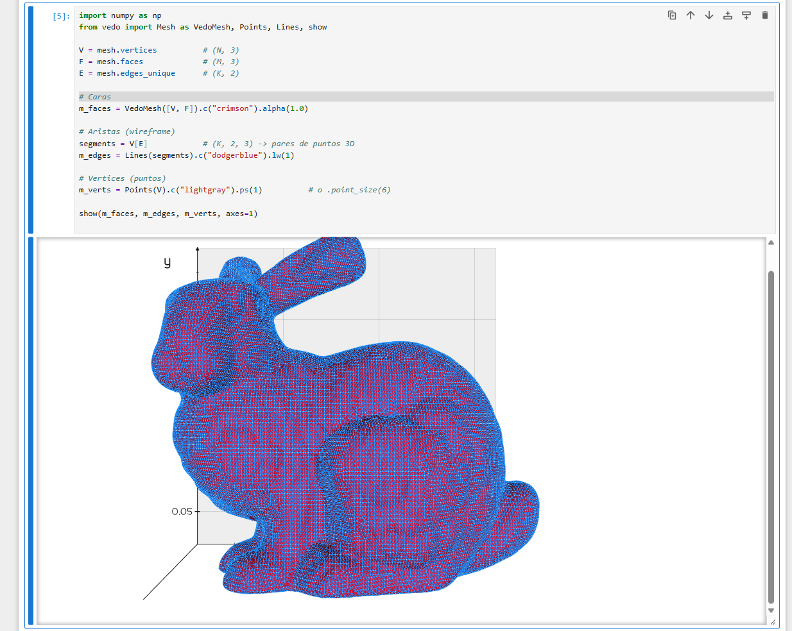
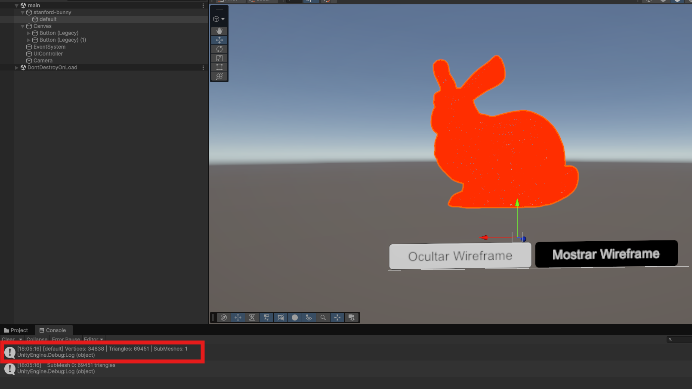
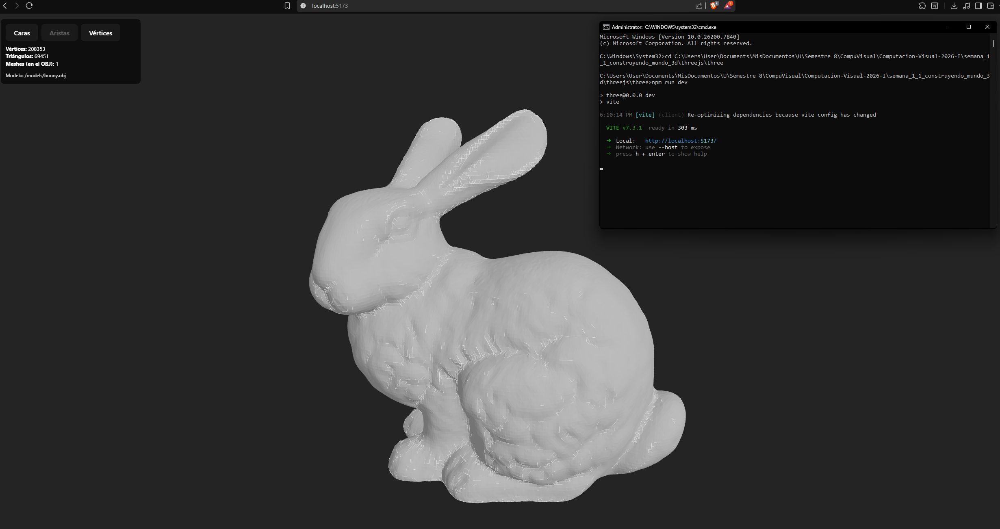

# Taller Semana 1.1 - Construyendo Mundo 3D

## Nombre del estudiante

Nicolas Quezada Mora

## Fecha de entrega

`2026-02-13`

---

## Descripcion breve

En este taller se trabajo la inspeccion y visualizacion de mallas 3D en tres entornos: React Three Fiber, Unity y Python. El modelo usado fue el bunny en formato `.obj` obtenido de https://github.com/alecjacobson/common-3d-test-models/tree/master.

El objetivo fue cargar la malla, explorar diferentes formas de visualizacion (caras, aristas y vertices) y reportar metricas estructurales del modelo. Ademas, se generaron evidencias visuales (GIF y captura) por cada implementacion en la carpeta `media/`.

---

## Implementaciones

### Python

En `python/Untitled.ipynb` se implemento el flujo con `trimesh`, `vedo`, `numpy` y `matplotlib`:

1. Carga de `models/bunny.obj` con `trimesh`.
2. Conteo estructural del modelo.
3. Visualizacion de caras, aristas y vertices con objetos `VedoMesh`, `Lines` y `Points`.
4. Exportacion de animacion de rotacion a `bunny_spin.gif`.

Metricas reportadas en notebook:
- Vertices: `34834`
- Aristas: `104288`
- Caras: `69451`

### Unity

En `unity/bunny` se importo el modelo `.obj` y se agregaron scripts en C#:

- `Assets/Scripts/BunnyMeshStats.cs`: imprime vertices, triangulos y sub-mallas del mesh.
- `Assets/Scripts/WireframeGizmo.cs`: dibuja wireframe con Gizmos (incluyendo hijos).
- `Assets/Scripts/ViewToggleUI.cs`: metodos `SetSolid()` y `SetWire()` para alternar vista solida/estructura via UI.

En la evidencia visual se observa el log con:
- Vertices: `34838`
- Triangles: `69451`
- SubMeshes: `1`

Version de Unity detectada en proyecto: `6000.3.8f1`.

### Three.js / React Three Fiber

En `threejs/three` se creo un proyecto con Vite + React + R3F:

- Carga del `.obj` con `OBJLoader`.
- Visualizacion interactiva con `OrbitControls`.
- Interfaz para alternar modo `faces`, `edges`, `vertices`.
- Overlay con `Edges` y render de vertices con `points`.
- Panel de estadisticas del modelo.

En la captura del proyecto web:
- Vertices: `208353`
- Triangulos: `69451`
- Meshes (OBJ): `1`

### Processing

No aplica en esta entrega.

---

## Resultados visuales

Los GIFs solicitados se encuentran en `media/` con el nombre correspondiente.

### Python - Implementacion


Visualizacion del modelo con rotacion y diferenciacion de elementos geometricos.



Notebook mostrando construccion de `m_faces`, `m_edges` y `m_verts` con `vedo`.

### Unity - Implementacion


Ejecucion en Unity con alternancia de vista y prueba de wireframe.



Escena con botones para modo de visualizacion y consola con metricas del mesh.

### Three.js / React Three Fiber - Implementacion


Modelo en React Three Fiber con camara orbit, modos de visualizacion y UI de estadisticas.



Vista del bunny en navegador con informacion estructural en tiempo real.

---

## Codigo relevante

### Python (`python/Untitled.ipynb`)

```python
import trimesh

def load_mesh(path: str) -> trimesh.Trimesh:
    obj = trimesh.load(path)
    if isinstance(obj, trimesh.Scene):
        geoms = list(obj.geometry.values())
        mesh = trimesh.util.concatenate(geoms)
    elif isinstance(obj, trimesh.Trimesh):
        mesh = obj
    else:
        raise TypeError(f"Tipo no soportado: {type(obj)}")
    return mesh

n_vertices = len(mesh.vertices)
n_faces    = len(mesh.faces)
n_edges    = len(mesh.edges_unique)
```

### Unity (`unity/bunny/Assets/Scripts/BunnyMeshStats.cs`)

```csharp
public void PrintStats()
{
    var mesh = GetMesh();
    int vertices = mesh.vertexCount;
    int trianglesTotal = mesh.triangles.Length / 3;
    int subMeshes = mesh.subMeshCount;

    Debug.Log($"[{name}] Vertices: {vertices} | Triangles: {trianglesTotal} | SubMeshes: {subMeshes}");
}
```

### Three.js / R3F (`threejs/three/src/App.jsx`, `threejs/three/src/BunnyOBJ.jsx`)

```jsx
<Canvas camera={{ position: [2, 2, 2], fov: 50 }}>
  <ambientLight intensity={0.7} />
  <directionalLight position={[5, 5, 5]} intensity={1.2} />
  <BunnyOBJ url="/models/bunny.obj" mode={mode} onStats={setStats} />
  <OrbitControls makeDefault />
</Canvas>
```

```jsx
{mode === "edges" && <Edges />}
{mode === "vertices" && <points geometry={geometry} material={pointsMaterial} />}
```

---

## Prompts utilizados

Se uso la inteligencia artificial para correccion de errores y la generacion de los scripts solicitados

---

## Aprendizajes y dificultades

### Aprendizajes

Se reforzo la diferencia entre representacion por caras, aristas y vertices en distintas plataformas y herramientas. Ademas de aprender a usar las diferentes platarformas para cargar archivos visuales.

### Dificultades

La parte que mas me represento dificultad fue el manejo del modelo en Unity ya que debeido a las herencias muchas veces cometia errores o asignaba scripts donde no correspondia.

### Mejoras futuras

Agregar soporte completo para `.stl` y `.gltf` en las diferentes implementaciones ya que solo se trabajo con `.obj`

---

## Contribuciones grupales (si aplica)

Taller realizado de forma individual.

---

## Estructura del proyecto

```text
semana_1_1_construyendo_mundo_3d/
|-- python/                     # Notebook y modelo .obj para analisis
|-- unity/                      # Proyecto Unity con scripts C#
|-- threejs/                    # Proyecto Vite + React Three Fiber
|-- media/                      # Evidencias (GIF/PNG) solicitadas
`-- Readme.md
```

---

## Referencias

- React Three Fiber docs: https://docs.pmnd.rs/react-three-fiber/
- Drei docs (`Edges`, `OrbitControls`): https://github.com/pmndrs/drei
- Three.js OBJLoader docs: https://threejs.org/docs/#examples/en/loaders/OBJLoader
- Unity Mesh API: https://docs.unity3d.com/ScriptReference/Mesh.html
- ChatGpt: https://chatgpt.com/
- trimesh docs: https://trimesh.org/
- vedo docs: https://vedo.embl.es/
