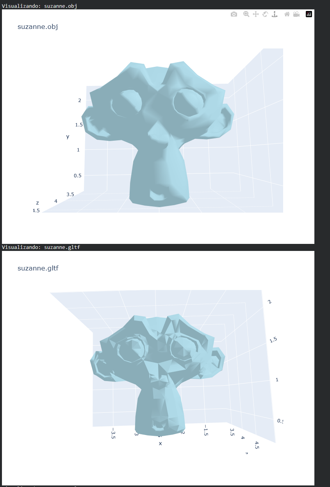
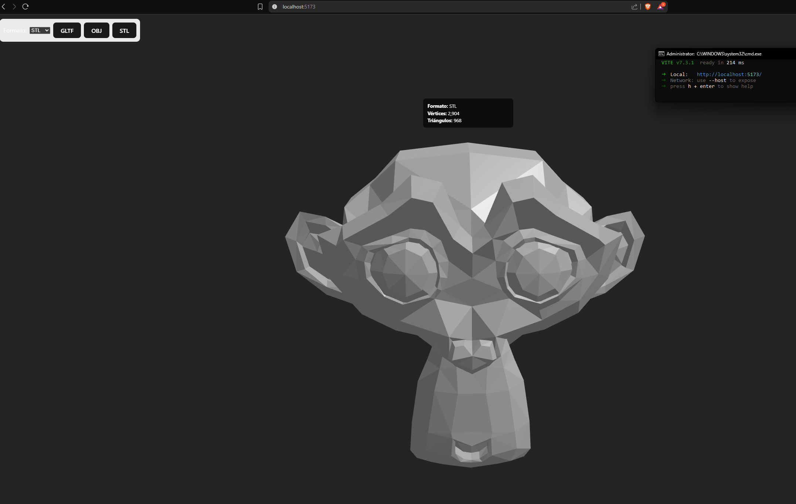

# Taller semana 1.2 - Conversion y comparacion de formatos 3D

## Nombre del estudiante

Nicolas Quezada Mora

## Fecha de entrega

`2026-02-14`

---

## Descripcion breve

En este taller se trabajo la lectura, comparacion, visualizacion y conversion de modelos 3D en formatos `OBJ`, `STL` y `GLTF`. El flujo en Python se desarrollo en notebook para medir propiedades geometricas de cada archivo y detectar diferencias estructurales entre formatos.

Adicionalmente se construyo un visor interactivo en React Three Fiber para cargar el mismo modelo en los tres formatos, alternar su visualizacion y comparar su comportamiento de renderizado.

---

## Implementaciones

### Python (Colab / Jupyter Notebook)

Archivo principal: `python/Tarea1_2.ipynb`

Actividades implementadas:

- Instalacion de librerias de trabajo: `trimesh`, `open3d`, `numpy`, `pandas`, `plotly`, `requests`.
- Descarga automatica del modelo `suzanne` en `OBJ`, `STL` y `GLTF`.
- Comparacion por formato de:
  - numero de vertices
  - numero de caras
  - normales por vertice y por cara
  - vertices y caras duplicadas
- Visualizacion 3D de cada formato.
- Conversion entre formatos usando `trimesh` (Ejemplo transformando `OBJ -> STL`).
- Bonus implementado: funcion para recorrer una carpeta, analizar archivos `obj/stl/gltf/glb` y exportar reporte en formato CSV.

### Three.js con React Three Fiber

Proyecto: `threejs/r3f-model-switcher/`

Actividades implementadas:

- Carga de los tres modelos (`.obj`, `.stl`, `.gltf`) desde `public/models/`.
- Alternancia de formato con `select` y botones (`GLTF`, `OBJ`, `STL`).
- Integracion de `OrbitControls` para inspeccion libre del modelo.
- Comparacion visual de renderizado (suavidad/materiales) usando iluminacion y materiales estandar.
- Bonus implementado: overlay en pantalla con formato activo y estadisticas solicitadas.

### Unity

No aplica en este taller.

### Processing

No aplica en este taller.

---

## Resultados visuales

### Python - Comparacion y visualizacion


Visualizacion del flujo de carga/comparacion del modelo en multiples formatos dentro del notebook.



Captura de resultados de analisis de malla y comparacion de propiedades geometricas.

### Three.js / React Three Fiber - Visor interactivo


Alternancia entre `GLTF`, `OBJ` y `STL` en la misma escena con control de camara.



Vista del panel de seleccion y overlay con metrica del modelo renderizado.

---

## Codigo relevante

### Python: conteo de duplicados y comparacion automatizada

```python
def duplicates_count_rows(arr):
    if arr is None or len(arr) == 0:
        return 0
    unique = np.unique(arr, axis=0)
    return int(len(arr) - len(unique))

def compare_folder(folder: Path, out_csv: Path = Path('comparison_report.csv')):
    rows = []
    for p in sorted(folder.rglob('*')):
        if p.suffix.lower() not in {'.obj', '.stl', '.gltf', '.glb'}:
            continue
        m = load_as_trimesh(p)
        v = np.asarray(m.vertices)
        f = np.asarray(m.faces)
        rows.append({
            'file': str(p),
            'vertices': int(len(v)),
            'faces': int(len(f)),
            'dup_vertices': duplicates_count_rows(np.round(v, 7)),
        })
    return pd.DataFrame(rows)
```

### React Three Fiber: cambio de formato y carga por loader

```jsx
const [format, setFormat] = useState("gltf");

{format === "obj"  && <ModelOBJ  url={url} onStats={onStats} />}
{format === "stl"  && <ModelSTL  url={url} onStats={onStats} />}
{format === "gltf" && <ModelGLTF url={url} onStats={onStats} />}

<OrbitControls makeDefault />
```

---

## Prompts utilizados

Prompt usado para complementar la documentacion de este README:

```text
Revisa el proyecto y edita la plantilla del read.me complementandolo con las actividades realizadas en la carpeta actual.
```
Se usaron prompts para la generacion de scripts y para corregir errores puntuales que surgieron sobre todo en la implementacion en python

---

## Aprendizajes y dificultades

### Aprendizajes

Esta actividad sirvio para aprender a manejar diferentes modelos independientemene de su formato comparando asi las diferencias de cada uno, aprendiendo a convertir de un modelo a otro y viendo tambien las diferencias entre cada uno tanto visualmente como estadisticamente

### Dificultades

C

### Mejoras futuras

- Agregar pipeline de conversion con `assimp` como segundo backend para comparar resultados frente a `trimesh`.
- Extender el comparador a varios modelos y reportes agregados por lote.

---

## Contribuciones grupales (si aplica)

Taller realizado de forma individual.

---

## Referencias
- ChatGpt: https://chatgpt.com/
- Trimesh docs: https://trimesh.org/
- Open3D docs: http://www.open3d.org/docs/latest/
- Assimp docs: https://github.com/assimp/assimp
- Three.js docs: https://threejs.org/docs/
- React Three Fiber docs: https://docs.pmnd.rs/react-three-fiber/
- EverseDevelopment/3DModelsFamousSamples: https://github.com/EverseDevelopment/3DModelsFamousSamples
