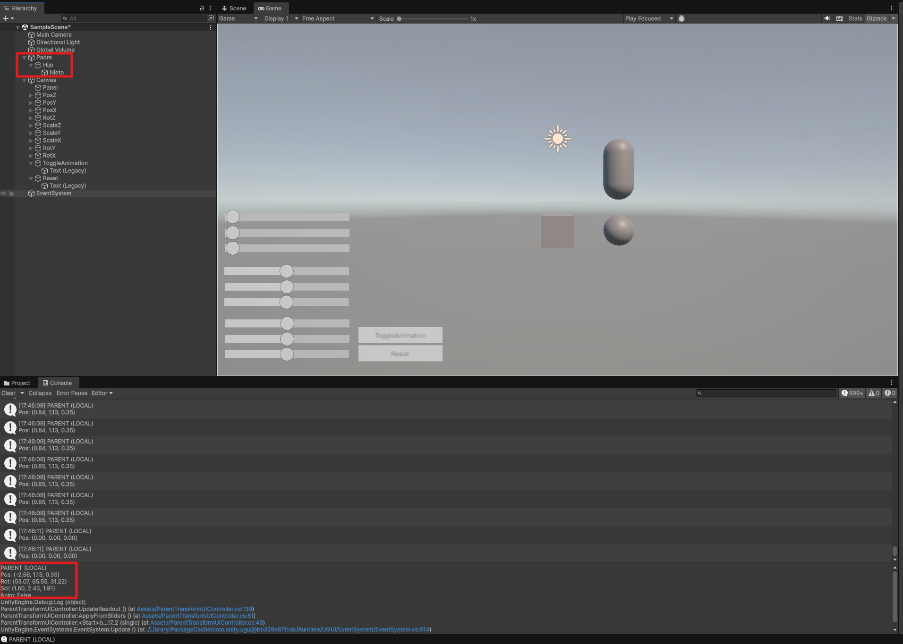
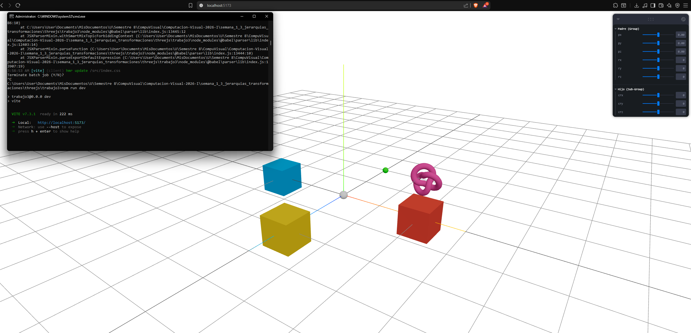

# Titulo del Taller

Jerarquias y Transformaciones 3D (Three.js con React Three Fiber + Unity LTS)

## Nombre del estudiante

Nicolas Quezada Mora

## Fecha de entrega

`2026-02-14`

---

## Descripcion breve

En este taller se implementaron dos proyectos para estudiar transformaciones y jerarquias: una en React Three Fiber y otra en Unity. El objetivo fue validar como la traslacion, rotacion y escala aplicadas al nodo padre afectan a sus descendientes.

En ambos entornos se construyo una jerarquia de al menos tres niveles y se agregaron controles en tiempo real con sliders para manipular el padre. Tambien se documentaron resultados visuales (capturas y GIFs) para evidenciar la herencia de transformaciones.

---

## Implementaciones

### Python

No aplica en esta carpeta.

### Unity

Proyecto en unity con jerarquia `Padre -> Hijo -> Nieto`.
Se desarrollo un script para:

- controlar posicion, rotacion y escala local del padre con sliders UI
- mostrar valores actuales de transformacion
- activar/desactivar una animacion del padre (`ToggleAnimation`)
- reiniciar estado inicial (`ResetTransform`).

La escena incluye botones `ToggleAnimation` y `Reset` enlazados al script.

### Three.js / React Three Fiber

Proyecto en threejs en el cual se implemento:

- un nodo padre con `<group>` y varios hijos `<mesh>`.
- controles en tiempo real con `leva` para traslacion y rotacion del padre.
- un subgrupo hijo con rotacion independiente.
- un tercer nivel jerarquico dentro del subgrupo (bonus implementado).

Tambien se uso `OrbitControls`, `gridHelper` y `axesHelper` para visualizar mejor el efecto de las transformaciones encadenadas.

### Processing

No aplica en esta carpeta.

---

## Resultados visuales

### Unity - Implementacion


GIF de la escena en ejecucion mostrando la herencia de transformaciones en `Padre -> Hijo -> Nieto` y el control por UI.



Captura de la escena con la jerarquia y panel de sliders/botones para posicion, rotacion, escala y animacion.

### Three.js - Implementacion


GIF de la escena en React Three Fiber con manipulacion del grupo padre y efecto en los objetos hijos.



Captura de la escena con controles de `Leva`, grilla y ejes para inspeccionar la jerarquia.

---

## Codigo relevante

### Unity (C#) - Aplicacion desde sliders

Archivo: `unity/Jerarquia/Assets/ParentTransformUIController.cs`

```csharp
public void ApplyFromSliders()
{
    parentTarget.localPosition = new Vector3(posX.value, posY.value, posZ.value);
    parentTarget.localEulerAngles = new Vector3(rotX.value, rotY.value, rotZ.value);
    parentTarget.localScale = new Vector3(scaleX.value, scaleY.value, scaleZ.value);
    UpdateReadout();
}
```

### Unity (C#) - Bonus animacion + reset

```csharp
public void ToggleAnimation()
{
    animate = !animate;
    UpdateReadout();
}

public void ResetTransform()
{
    animate = false;
    parentTarget.localPosition = initialLocalPos;
    parentTarget.localEulerAngles = initialLocalEuler;
    parentTarget.localScale = initialLocalScale;
    SetSlidersFromTransform();
}
```

### Three.js / R3F - Grupo padre + subgrupo

Archivo: `threejs/trabajo3/src/App.jsx`

```jsx
<group position={[px, py, pz]} rotation={[degToRad(rx), degToRad(ry), degToRad(rz)]}>
  <mesh position={[2, 0, 0]}>{/* hijo */}</mesh>
  <mesh position={[-2, 0, 0]}>{/* hijo */}</mesh>

  <group position={[0, 0, -2]} rotation={[degToRad(crx), degToRad(cry), degToRad(crz)]}>
    <mesh>{/* nieto/subnivel */}</mesh>
  </group>
</group>
```

---

## Prompts utilizados

Se utilizaron prompts para la generacion de los scripts usados en los dos proyectos y tambien para la solucion de errores o explicacion de incongruencias presentadas en el desarrollo del proyecto.

---

## Aprendizajes y dificultades

### Aprendizajes

Se reforzo la diferencia entre transformaciones locales y globales, y como la jerarquia afecta a cada uno de los objetos que forman parte. Tambien se fortalecio la implementacion de interfaces graficas que afectan en tiempo real a los objetos.

### Dificultades

La parte mas complicada fue sincronizar la interfaz y el estado del objeto padre en Unity sin que ocurrieran errores como que desaparecieran los objetos o se hicieran minusculos.

### Mejoras futuras

Agregar indicadores visuales por nodo y en tiempo real en unity, no solo por consola y mostrar valores mas detallados en pantalla dentro de Three.js.

---

## Contribuciones grupales (si aplica)

Taller realizado de forma individual.

---

## Referencias

- React Three Fiber docs: https://docs.pmnd.rs/react-three-fiber
- drei docs: https://github.com/pmndrs/drei
- Leva docs: https://github.com/pmndrs/leva
- ChatGPT: https://chatgpt.com/
- Unity Manual - Transform Component: https://docs.unity3d.com/Manual/class-Transform.html
- Unity Manual - UI Slider: https://docs.unity3d.com/Manual/script-Slider.html
