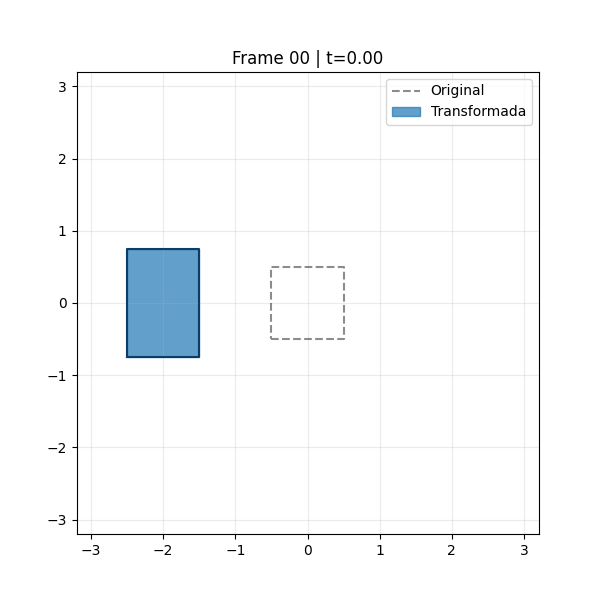
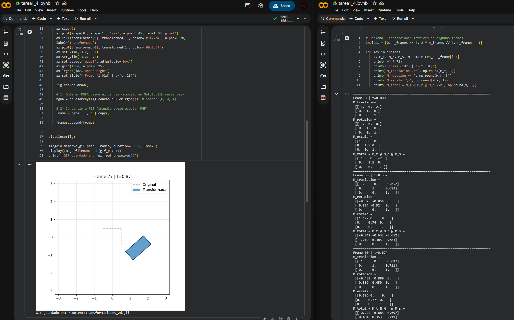
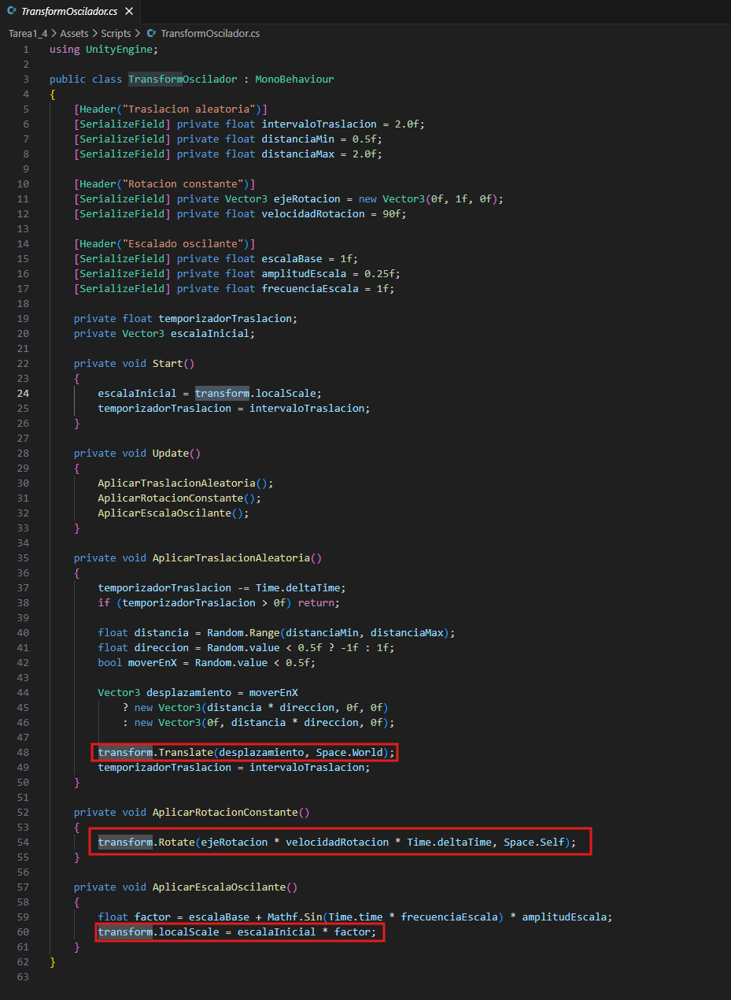
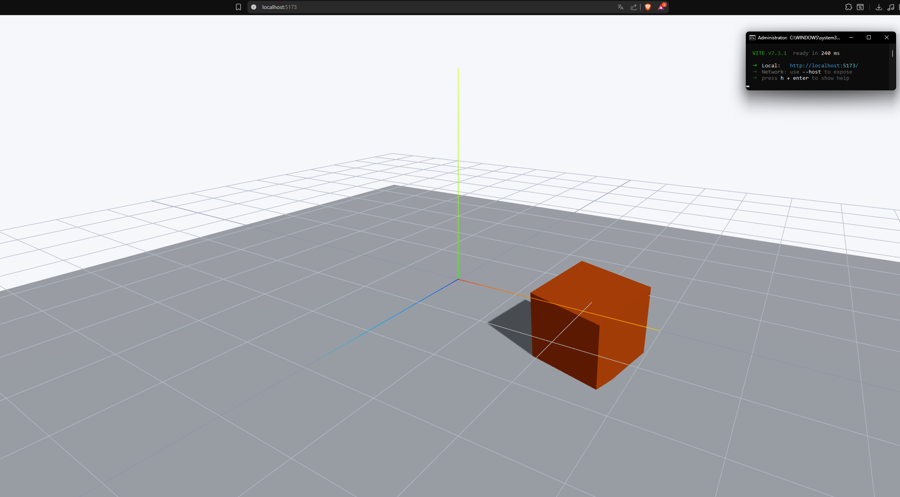
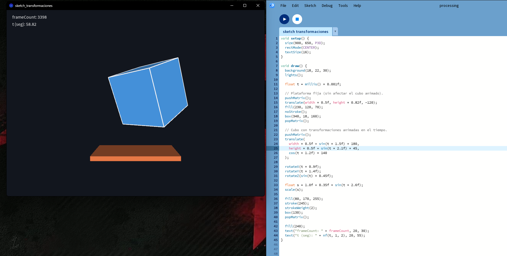

# Taller 1.4 - Transformaciones y Animaciones

## Nombre del estudiante

Nicolas Quezada Mora

## Fecha de entrega

`2026-02-15`

---

## Descripcion breve

En este taller se implementaron transformaciones geometricas en cuatro entornos: Python, Unity, Three.js y Processing. El objetivo fue aplicar traslacion, rotacion y escala como funciones del tiempo para producir animaciones reproducibles.

---

## Implementaciones realizadas

### 1) Python (Colab o Jupyter Notebook)


- Se crea una figura 2D (cuadrado) en coordenadas homogeneas.
- Se definen matrices 3x3 de traslacion, rotacion y escala.
- Se compone la transformacion total y se anima.
- Se exporta el resultado como GIF.
- Se incluye bloque opcional para imprimir matrices por frame.

### 2) Unity (version LTS) - Opcional

- Escena 3D con objeto al que se le aplica el script `TransformOscilador`.
- Traslacion aleatoria cada cierto intervalo en eje X o Y.
- Rotacion constante dependiente de una funcion.
- Escalado oscilante.

### 3) Three.js con React Three Fiber

- Objeto 3D principal: cubo.
- Traslacion con trayectoria senoidal/circular en todos los ejes.
- Rotacion incremental por frame usando `delta`.
- Escala suave.
- Se incluye `OrbitControls` para podes tener una mejor observacion.


### 4) Processing (2D o 3D)

- Sketch en `P3D`.
- Figura geometrica principal: caja.
- Uso de `translate()`, `rotateX/Y/Z()` y `scale()`.
- Uso de matrices para aislar transformaciones.
- Animacion temporal.

---

## Resultados visuales

### Python



Animacion de transformaciones 2D usando matrices homogeneas.



Vista estatica de la ejecucion del notebook.

### Unity


Objeto con traslacion aleatoria, rotacion constante y escala oscilante.



Vista de la escena en Unity.

### Three.js / React Three Fiber




Escena con cubo animado por `useFrame` y navegacion con `OrbitControls`.

### Processing


Cubo 3D con movimiento ondulado, rotaciones y escala ciclica.



Vista del sketch en ejecucion.

---

## Codigo relevante

### Python (matrices y composicion)

```python
def T(tx, ty):
    return np.array([[1.0, 0.0, tx], [0.0, 1.0, ty], [0.0, 0.0, 1.0]])

def R(theta):
    c, s = np.cos(theta), np.sin(theta)
    return np.array([[c, -s, 0.0], [s, c, 0.0], [0.0, 0.0, 1.0]])

def S(sx, sy):
    return np.array([[sx, 0.0, 0.0], [0.0, sy, 0.0], [0.0, 0.0, 1.0]])

M = M_t @ M_r @ M_s
```

### Unity (Update con tres transformaciones)

```csharp
private void Update()
{
    AplicarTraslacionAleatoria();
    AplicarRotacionConstante();
    AplicarEscalaOscilante();
}
```

### React Three Fiber (animacion por frame)

```jsx
useFrame((state, delta) => {
  const t = state.clock.elapsedTime;
  meshRef.current.position.x = Math.cos(t) * 2;
  meshRef.current.position.y = Math.sin(t * 2) * 0.8;
  meshRef.current.rotation.y += delta * 1.8;
  const scale = 1 + 0.25 * Math.sin(t * 2.5);
  meshRef.current.scale.set(scale, scale, scale);
});
```

### Processing (transformaciones animadas)

```java
translate(width * 0.5f + sin(t * 1.5f) * 180, height * 0.5f, cos(t * 1.2f) * 140);
rotateX(t * 0.9f);
rotateY(t * 1.4f);
float s = 1.0f + 0.35f * sin(t * 2.6f);
scale(s);
```

## Prompts utilizados

Se usaron prompts para la generacion de cada uno de los scripts preguntando de que manera realizarlos optimamente y para la correccion de errores preguntando por el error en particular y como corregirlo

---

## Aprendizajes y dificultades

### Aprendizajes

Se aprendio a realizar diferentes tipos de movimientos como escalados, rotaciones y traslaciones de manera automatica en diferentes entornos y se uso por primera vez processing.

### Dificultades

En este taller lo que mas represento dificultad fue generar los scripts ya que estos eran los que se encargaban de realizar los diversos movimientos solicitados.

### Mejoras futuras

Para mejoras futuras se podria incluir una manera de alternar entre movimientos automatico y manuales aplicados a las figuras.

---

## Contribucion

Taller realizado de forma individual.

---

## Referencias

- Numpy: https://numpy.org/doc/
- Matplotlib: https://matplotlib.org/stable/users/index.html
- ImageIO: https://imageio.readthedocs.io/
- ChatGPT: https://chatgpt.com/
- Unity Transform API: https://docs.unity3d.com/ScriptReference/Transform.html
- React Three Fiber: https://docs.pmnd.rs/react-three-fiber/getting-started/introduction
- Processing Reference: https://processing.org/reference/