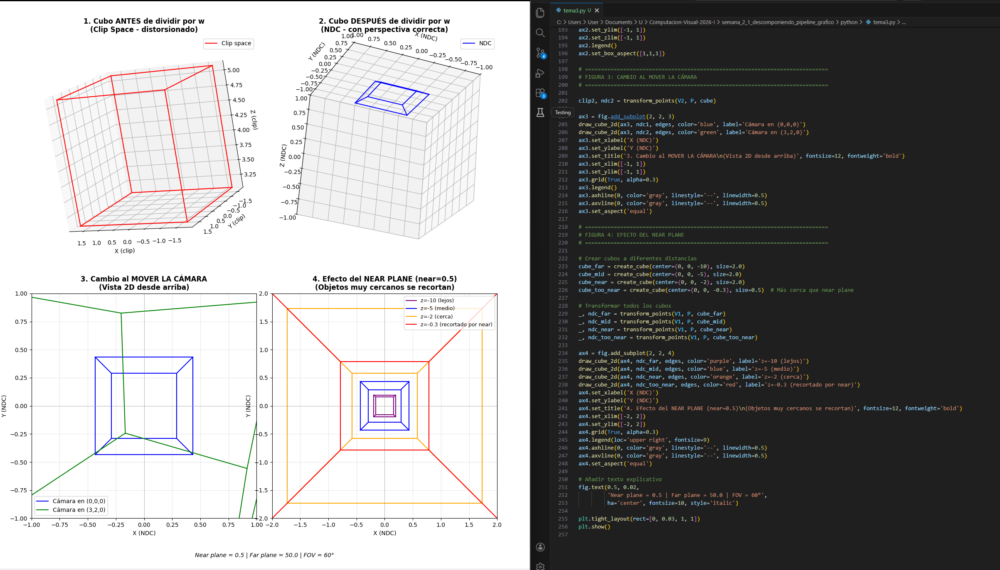

# Actividad S2_1 - Descomponiendo el Pipeline Grafico

## Tema seleccionado
3 Espacio Clip, NDC y Division por W

## Nombre del estudiante(s)
- Nicolas Quezada Mora
- Juan Sebastian Tinjaca Mesa
- Jeronimo Bermudez Hernandez

## Fecha de entrega
Hoy (19 de febrero de 2026)

## Descripcion del tema
Esta actividad muestra como los vertices de un objeto 3D pasan por una transformacion de proyeccion en perspectiva, primero en espacio clip y luego en coordenadas NDC. El foco principal es entender por que la division por `w` es necesaria para obtener la perspectiva correcta.

Tambien se explora como cambia la proyeccion al mover la camara y como el plano cercano (`near plane`) afecta los objetos cuando estan demasiado cerca, produciendo recorte.

## Explicacion matematica resumida
Para un vertice en coordenadas homogeneas de vista `v_view = (x, y, z, 1)`, se aplica la matriz de proyeccion:

`v_clip = P * v_view = (x_c, y_c, z_c, w_c)`

Despues se realiza la division por `w`:

`x_ndc = x_c / w_c`
`y_ndc = y_c / w_c`
`z_ndc = z_c / w_c`

Con esto se obtiene el espacio NDC, donde normalmente los valores quedan en el rango `[-1, 1]`. Esta division es la que introduce el efecto de perspectiva: objetos mas lejanos se ven mas pequenos.

## Descripcion de la implementacion
La implementacion se realizo en `python/tema3.py` usando `numpy` y `matplotlib`. El script:

1. Construye la matriz de proyeccion en perspectiva.
2. Construye la matriz de vista para posicionar camara y objetivo.
3. Genera vertices de un cubo y sus aristas.
4. Transforma los vertices a clip space y luego a NDC con division por `w`.
5. Visualiza cuatro casos: clip space, NDC, cambio de camara y efecto del near plane.

## Resultados visuales (minimo 2 evidencias)
Las evidencias estan en la carpeta `media/`.



Figura con las visualizaciones del cubo antes y despues de la division por `w`, cambio de camara y efecto del plano cercano.


Animacion/evidencia visual del resultado generado para la actividad.

## Codigo relevante
Archivo: `python/tema3.py`

```python
def perspective(fov_y_deg, aspect, near, far):
    f = 1.0 / np.tan(np.deg2rad(fov_y_deg) / 2.0)
    P = np.zeros((4, 4), dtype=float)
    P[0, 0] = f / aspect
    P[1, 1] = f
    P[2, 2] = (far + near) / (near - far)
    P[2, 3] = (2 * far * near) / (near - far)
    P[3, 2] = -1.0
    return P
```

```python
def transform_points(V, P, points3):
    ph = to_homogeneous(points3)
    view_space = (V @ ph.T).T
    clip = (P @ view_space.T).T
    w = clip[:, 3:4]
    ndc = clip[:, 0:3] / w
    return clip, ndc
```

## Prompts utilizados (si aplico IA)
Se uso la IA para la correccion de errores del script y la investigacion de los temas explicados.

## Aprendizajes y dificultades
Se aprendio acerca de como el computador maneja las perspecitvas de las formas 3D y acerca de todas las operaciones involucradas en el proceso

Dificultades que se presentaron fue mayormente el poco tiempo que se tuvo para hacer la presentacion
