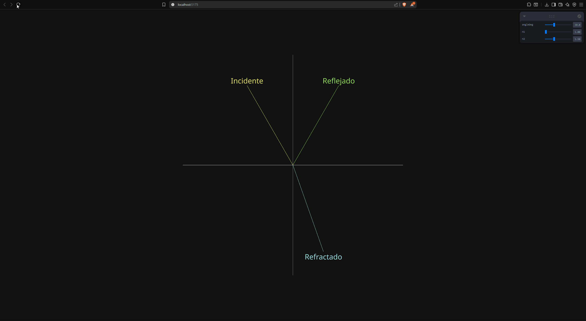
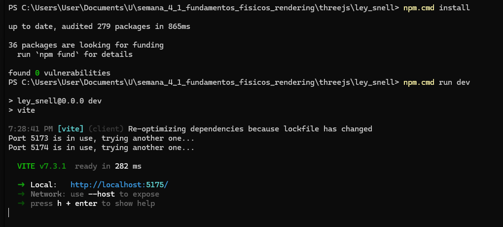

# Actividad S4_1 - Fundamentos Fisicos del Rendering

## Tema seleccionado
4. Optica Geometrica y Sistemas de Imagen

## Nombre del estudiante(s)
- Nicolas Quezada Mora
- Juan Jose Alvarez Lozano
- Jorge Isaac Alandete Diaz
- Jeronimo Bermudez Hernandez

## Fecha de entrega
`2026-03-03`

---

## Descripcion del tema
En esta actividad se trabajo el comportamiento de la luz cuando pasa entre dos medios con diferente indice de refraccion. El objetivo fue representar de manera interactiva los fenomenos de incidencia, reflexion y refraccion, que son base de la optica geometrica.

La simulacion permite observar como cambia la direccion del rayo al modificar el angulo de incidencia y los indices de refraccion de cada medio. Tambien se visualiza el caso de reflexion total interna cuando no existe solucion real para el angulo refractado.

---

## Explicacion matematica resumida
Se aplicaron dos relaciones principales:

1. Ley de reflexion:

`theta_r = theta_i`

donde `theta_i` es el angulo incidente y `theta_r` el reflejado, medidos respecto a la normal.

2. Ley de Snell:

`n1 * sin(theta1) = n2 * sin(theta2)`

Despejando:

`sin(theta2) = (n1 / n2) * sin(theta1)`

Si `sin(theta2) > 1`, no existe refraccion fisica y ocurre reflexion total interna.

---

## Descripcion de la implementacion
La implementacion se realizo en **Three.js con React Three Fiber** dentro de `threejs/ley_snell`.

Elementos principales:
- Interfaz interactiva con `Leva` para controlar `angleDeg`, `n1` y `n2`.
- Dibujo de frontera entre medios y linea normal usando `Line` de `@react-three/drei`.
- Calculo en tiempo real de rayo incidente, reflejado y refractado con `THREE.MathUtils.degToRad`, `Math.sin` y `Math.asin`.
- Deteccion de reflexion total interna cuando `sinTheta2 > 1`.

Flujo de ejecucion:
1. Convertir el angulo de grados a radianes.
2. Calcular direccion del rayo incidente.
3. Calcular rayo reflejado usando el mismo angulo respecto a la normal.
4. Aplicar Ley de Snell para el rayo refractado.
5. Renderizar etiquetas y lineas en la escena ortografica.

---

## Resultados visuales (minimo 2 evidencias)

### Evidencia 1 - Simulacion interactiva


Se observan los tres rayos (incidente, reflejado y refractado), la normal y la frontera de medios. Al variar parametros, cambia la geometria de los rayos en tiempo real.

### Evidencia 2 - Ejecucion del entorno


Se muestra la ejecucion del proyecto en entorno local con `npm run dev` y el servidor de Vite listo en `localhost`.

---

## Codigo relevante
Archivo: `threejs/ley_snell/src/App.jsx`

```jsx
const sinTheta2 = (n1 / n2) * Math.sin(theta1);

let refractedEnd = null;
let totalInternalReflection = false;

if (sinTheta2 <= 1) {
  const theta2 = Math.asin(sinTheta2);
  const refractedDir = new THREE.Vector3(
    Math.sin(theta2),
    -Math.cos(theta2),
    0
  );
  refractedEnd = origin.clone().add(refractedDir.multiplyScalar(5));
} else {
  totalInternalReflection = true;
}
```

Este bloque implementa la Ley de Snell y determina cuando ocurre reflexion total interna.

---

## Prompts utilizados (si aplico IA)
Se aplico IA para apoyar la realizacion de graficas y validacion conceptual. Ejemplos de prompts usados:

```text
"Genera una explicacion breve de la Ley de Snell con enfoque en simulacion interactiva."

"Crea una grafica conceptual de incidencia, reflexion y refraccion con etiquetas de angulos."

"Explica como detectar reflexion total interna cuando n1 > n2 en una simulacion."
```

---

## Aprendizajes y dificultades

### Aprendizajes
- Se reforzo la relacion entre formulacion matematica y representacion visual en tiempo real.
- Quedo mas claro el rol del indice de refraccion en el cambio de direccion del rayo.
- Se practico integracion entre fisica basica, algebra trigonometrica y renderizado con React Three Fiber.

### Dificultades
- Ajustar la orientacion correcta de vectores para mantener coherencia geometrica en pantalla.
- Manejar correctamente el caso limite de reflexion total interna sin generar errores visuales.
- Afinar la presentacion de etiquetas y lineas para que la escena fuera clara en distintos parametros.

### Mejoras futuras
- Incluir visualizacion numerica de angulos `theta1` y `theta2` en tiempo real.
- Agregar graficas complementarias (por ejemplo, `theta2` vs `theta1` para distintos indices).
- Extender la simulacion a superficies curvas para conectar con sistemas de lentes.

---

## Referencias
- Documentacion React Three Fiber: https://docs.pmnd.rs/react-three-fiber/
- Documentacion Three.js: https://threejs.org/docs/
- Conceptos de Ley de Snell y reflexion total interna (optica geometrica).
